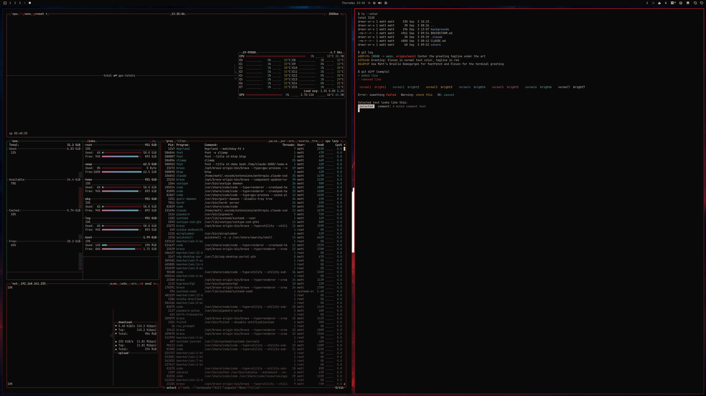
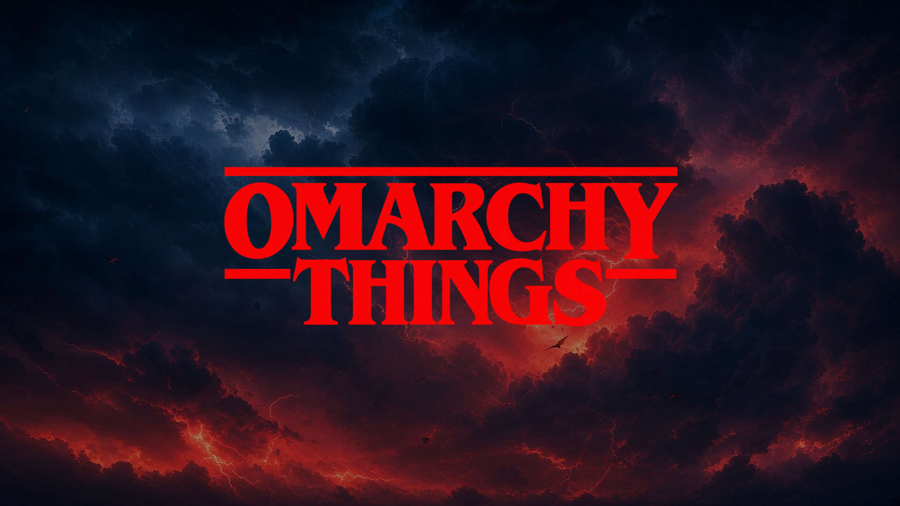
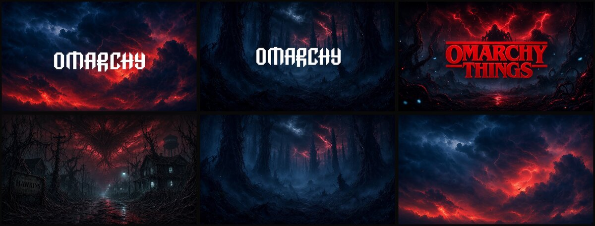
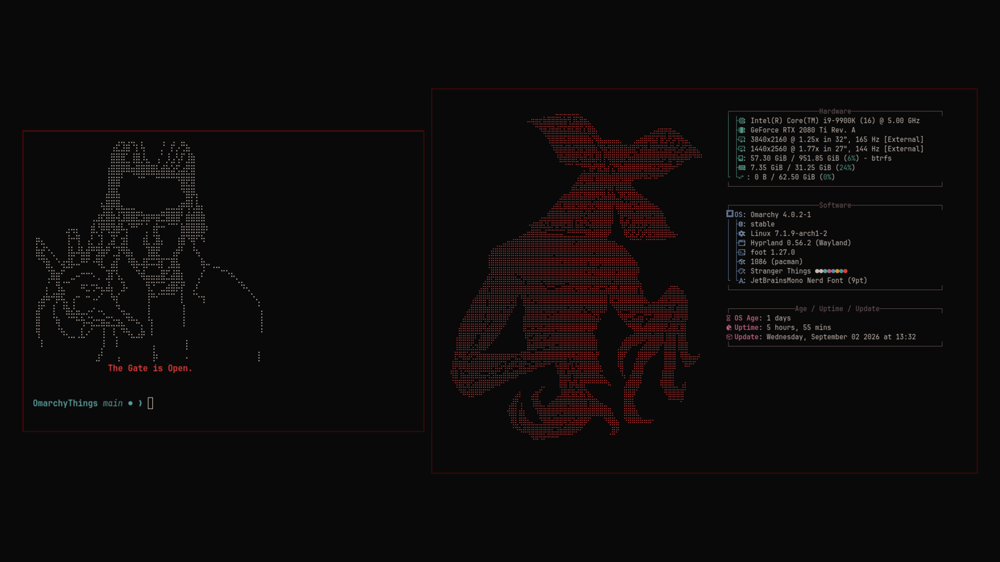
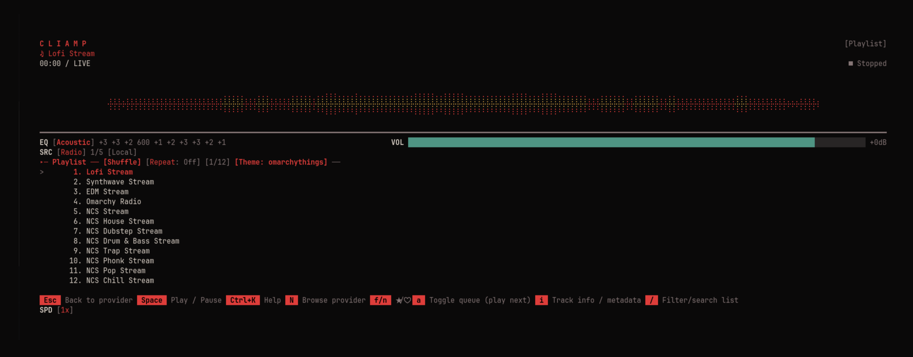

# 🔴 OmarchyThings

An [Omarchy](https://omarchy.org) theme inspired by Stranger Things. Poster black,
blood red, a thin teal horizon, and amber city lights. Dark first, readable
always.



## ✨ What you get

- **Palette** built from the Season 5 poster: near-black background, deep red
  accent, muted teal and amber secondaries. Text is a warm cream at roughly
  10:1 contrast, so it is easy on the eyes for long sessions.
- **Everything themed at once**: terminals (foot, Alacritty, Kitty, Ghostty),
  Neovim, btop, Helix, the Omarchy bar, launcher, notifications, lock screen,
  Chromium, VS Code, Obsidian, Claude Code, and the keyboard backlight.
- **Window borders** fade from poster red into dried-blood red.
- **Six 4K wallpapers** of the Upside Down, Hawkins, and red storm skies.
- **Boot screen** with the OMARCHY THINGS wordmark (see below).



## 📦 Install

```bash
omarchy theme install https://github.com/matthewguenther/omarchy-omarchy-things-theme.git
```

The theme is applied right away. Later, switch with:

```bash
omarchy theme set omarchy-things
omarchy theme bg next        # cycle wallpapers
```

## 🎨 Wallpapers



Six variants live in `backgrounds/`, all 3840x2160. Add your own next to
them, or drop extra images into `~/.config/omarchy/backgrounds/omarchy-things/`
to keep them out of the theme folder.

## 🔐 Boot screen logo

`unlock.png` is not the session lock screen. Omarchy uses it for the
**boot screen** (Plymouth), the screen that asks for your disk password when
the computer starts. To switch the boot screen to this theme, open the
Omarchy menu, go to **Style > Unlock**, and pick this theme. It asks for
your password because it edits the boot image. Pick **Default** in the same
menu to go back.

The session lock screen (Super+Escape) always shows a blurred copy of your
wallpaper. That is Omarchy's design, and themes cannot change it.

## 👾 Extras (optional)





A Demogorgon on the About screen, Eleven greeting you in every new terminal,
and a matching theme for the cliamp music player. Omarchy cannot install
these from a theme, so there is a one-shot script:

```bash
~/.config/omarchy/themes/omarchy-things/extras/install.sh
```

What it changes:

- copies files into `~/.config/omarchy-things/` and `~/.config/cliamp/themes/`
- adds one marked block at the end of `~/.bashrc` (a backup is kept as
  `.bashrc.bak.omarchy-things`)
- installs a theme hook that, whenever this theme is active, switches cliamp
  to its OmarchyThings look and puts the Demogorgon in Omarchy's About logo
  slot (`~/.config/omarchy/branding/about.txt`, original kept as a backup).
  Pick another theme and both go back.

The greeting and the Demogorgon only show while this theme is the active one,
so other themes are left alone.

To remove all of it:

```bash
~/.config/omarchy/themes/omarchy-things/extras/install.sh --uninstall
```

## 🛠️ Hacking on it

- `colors.toml` is the whole palette. Check readability after edits with
  `python3 docs/contrast.py colors.toml`.
- `docs/OMARCHY-THEME-REFERENCE.md` explains how Omarchy turns that file into
  every app config, and which files a git-installed theme is not allowed to
  ship.
- `extras/tools/make-unlock.sh` regenerates the boot-screen preview image.

## 🙏 Credits

- Demogorgon and Eleven Braille art from
  [emojicombos.com](https://emojicombos.com/stranger-things-ascii-art).
- Built on Omarchy's theme system by DHH and the Omarchy community.
- Made with help from Claude and Grok. Mentioned here because I'd rather be
  transparent about it.

## 🤝 Contributing

I'd gladly take help from anyone who wants to iterate on this: upscaling the
wallpapers properly, better art, palette tweaks, new extras, anything. Open an
issue or a pull request. I'm here for the community <3

## ⚖️ License and disclaimer

MIT, see `LICENSE`.

Fan-made and unofficial. Not affiliated with Netflix or the creators of
Stranger Things. No official artwork, logos, or fonts are included.
